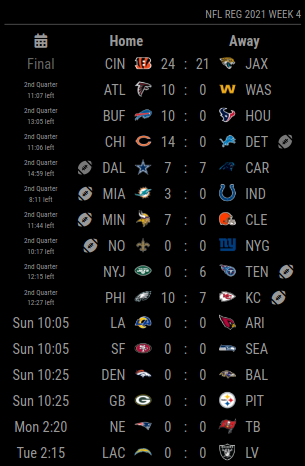
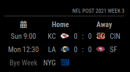
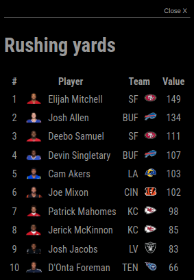
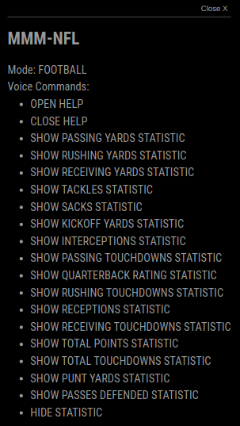

# MMM-NFL

[](https://raw.githubusercontent.com/fewieden/MMM-NFL/master/LICENSE)  [](https://codeclimate.com/github/fewieden/MMM-NFL) [](https://snyk.io/test/github/fewieden/mmm-nfl)

National Football League Module for MagicMirror<sup>2</sup>

## Example

   

## Dependencies

* An installation of [MagicMirror<sup>2</sup>](https://github.com/MichMich/MagicMirror)
* npm
* [node-fetch](https://www.npmjs.com/package/node-fetch)

## Installation

1. Clone this repo into `~/MagicMirror/modules` directory.
1. Configure your `~/MagicMirror/config/config.js`:

    ```
    {
        module: 'MMM-NFL',
        position: 'top_right',
        config: {
            // all your config options, which are different than their default values
        }
    }
    ```

1. Run command `npm install --production` in `~/MagicMirror/modules/MMM-NFL` directory.

## Global config

| **Option** | **Default** | **Description** |
| --- | --- | --- |
| `locale` | `undefined` | By default it is using your system settings. You can specify the locale in the global MagicMirror config. Possible values are for e.g.: `'en-US'` or `'de-DE'`. |

To set a global config you have to set the value in your config.js file inside the MagicMirror project.


## Config Options

| **Option** | **Default** | **Description** |
| --- | --- | --- |
| `colored` | `false` | Remove black/white filter of logos. |
| `focus_on` | `false` | Display only matches with teams of this array e.g. `['NYG', 'DAL', 'NE']`. |
| `format` | `'ddd h:mm'` | In which format the date should be displayed. [All Options](http://momentjs.com/docs/#/displaying/format/) |
| `reloadInterval` | `1800000` (30 mins) | How often should the data be fetched. |
| `reverseTeams` | `false` | Flag to switch order of home and away team. |
| `tableSize` | `'small'` | Font size of table. Possible values: `'xsmall'`, `'small'`, `'medium'`, `'large'` and `'xlarge'` |

## OPTIONAL: Voice Control and Modal

This module supports voice control by [MMM-voice](https://github.com/fewieden/MMM-voice) and [MMM-Modal](https://github.com/fewieden/MMM-Modal).
In order to use this feature, it's required to install the voice and modal modules. There are no extra config options for voice control and modals needed.

### Mode

The voice control mode for this module is `FOOTBALL`

### List of all Voice Commands

* OPEN HELP -> Shows the information from the readme here with mode and all commands.
* CLOSE HELP -> Hides the help information.
* SHOW PASSING YARDS STATISTIC -> Shows statistic of players with most passing yards.
* SHOW RUSHING YARDS STATISTIC -> Shows statistic of players with most rushing yards.
* SHOW RECEIVING YARDS STATISTIC -> Shows statistic of players with most receiving yards.
* SHOW TACKLES STATISTIC -> Shows statistic of players with most tackles.
* SHOW SACKS STATISTIC -> Shows statistic of players with most sacks.
* SHOW KICKOFF YARDS STATISTIC -> Shows statistic of players with most kickoff yards.
* SHOW INTERCEPTIONS STATISTIC -> Shows statistic of players with most interceptions.
* SHOW PASSING TOUCHDOWNS STATISTIC -> Shows statistic of players with most passing touchdowns.
* SHOW QUARTERBACK RATING STATISTIC -> Shows statistic of quarterbacks with best rating.
* SHOW RUSHING TOUCHDOWNS STATISTIC -> Shows statistic of players with most rushing touchdowns.
* SHOW RECEPTIONS STATISTIC -> Shows statistic of players with most receptions.
* SHOW RECEIVING TOUCHDOWNS STATISTIC -> Shows statistic of players with most receiving touchdowns.
* SHOW TOTAL POINTS STATISTIC -> Shows statistic of players with most points.
* SHOW TOTAL TOUCHDOWNS STATISTIC -> Shows statistic of players with most touchdowns.
* SHOW PUNT YARDS STATISTIC -> Shows statistic of players with most punt yards.
* SHOW PASSES DEFENDED STATISTIC -> Shows statistic of players with most passes defended.
* HIDE STATISTIC -> Hide statistic informations

## Developer

* `npm run lint` - Lints JS and CSS files.
