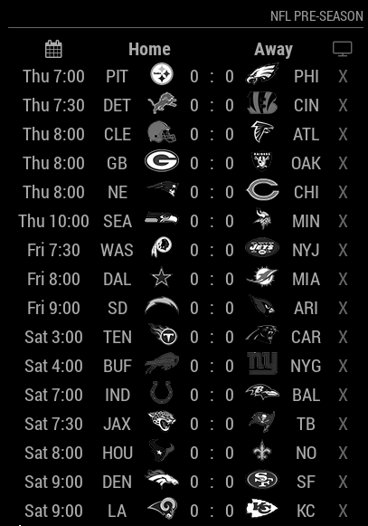
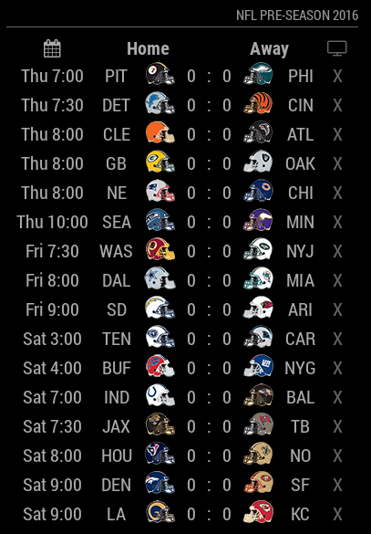
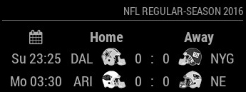
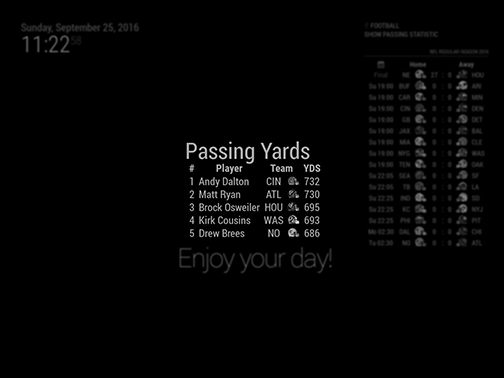
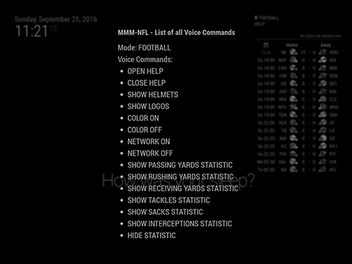

# MMM-NFL
National Football League Module for MagicMirror<sup>2</sup>

## Example

            

## Dependencies
  * An installation of [MagicMirror<sup>2</sup>](https://github.com/MichMich/MagicMirror)
  * OPTIONAL: [Voice Control](https://github.com/fewieden/MMM-voice)
  * npm
  * [request](https://www.npmjs.com/package/request)
  * [xml2js](https://www.npmjs.com/package/xml2js)

## Installation
 1. Clone this repo into `~/MagicMirror/modules` directory.
 2. Configure your `~/MagicMirror/config/config.js`:

    ```
    {
        module: 'MMM-NFL',
        position: 'top_right',
        config: {
            ...
        }
    }
    ```
 3. Run command `npm install` in `~/MagicMirror/modules/MMM-NFL` directory.

## Config Options
| **Option** | **Default** | **Description** |
| --- | --- | --- |
| `colored` | `false` | Remove black/white filter of logos/helmets. |
| `helmets` | `false` | Show helmets instead of logo. |
| `focus_on` | `false` | Display only matches with teams of this array e.g. `['NYG', 'DAL', 'NE']`. |
| `format` | `'ddd h:mm'` | In which format the date should be displayed. [All Options](http://momentjs.com/docs/#/displaying/format/) |
| `reloadInterval` | `1800000` (30 mins) | How often should the data be fetched |

## OPTIONAL: Voice Control
This module supports voice control by [MMM-voice](https://github.com/fewieden/MMM-voice). In order to use this feature, it's required to install the voice module. There are no extra config options for voice control needed.

### Mode
The voice control mode for this module is `FOOTBALL`

### List of all Voice Commands
  * OPEN HELP -> Shows the information from the readme here with mode and all commands.
  * CLOSE HELP -> Hides the help information.
  * SHOW HELMETS -> Switch team logos to helmets. (Effect stays until your mirror restarts, for permanent change you have to edit the config)
  * SHOW LOGOS -> Switch team helmets to logos. (Effect stays until your mirror restarts, for permanent change you have to edit the config)
  * COLOR ON -> Switch color for team logos/helmets on. (Effect stays until your mirror restarts, for permanent change you have to edit the config)
  * COLOR OFF -> Switch color for team logos/helmets off. (Effect stays until your mirror restarts, for permanent change you have to edit the config)
  * SHOW PASSING YARDS STATISTIC -> Shows statistic of Top 5 passing players.
  * SHOW RUSHING YARDS STATISTIC -> Shows statistic of Top 5 rushing players.
  * SHOW RECEIVING YARDS STATISTIC -> Shows statistic of Top 5 receiving players.
  * SHOW TACKLES STATISTIC -> Shows statistic of Top 5 tackling players.
  * SHOW SACKS STATISTIC -> Shows statistic of Top 5 sacking players.
  * SHOW INTERCEPTIONS STATISTIC -> Shows statistic of Top 5 intercepting players.
  * HIDE STATISTIC -> Hide statistic informations