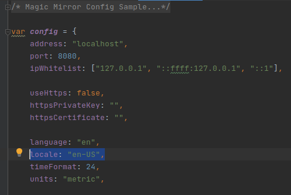

# MMM-NFL

[](https://raw.githubusercontent.com/fewieden/MMM-NFL/master/LICENSE) [](https://codeclimate.com/github/fewieden/MMM-NFL) [](https://snyk.io/test/github/fewieden/mmm-nfl)

National Football League Module for MagicMirror<sup>2</sup>

## Example

     

## Dependencies

* An installation of [MagicMirror<sup>2</sup>](https://github.com/MichMich/MagicMirror)
* npm
* [node-fetch](https://www.npmjs.com/package/node-fetch)

## Installation

1. Clone this repo into `~/MagicMirror/modules` directory.
1. Configure your `~/MagicMirror/config/config.js`:

    ```
    {
        module: 'MMM-NFL',
        position: 'top_right',
        config: {
            // all your config options, which are different than their default values
        }
    }
    ```

1. Run command `npm install --production` in `~/MagicMirror/modules/MMM-NFL` directory.

## Global config

| **Option** | **Default** | **Description** |
| --- | --- | --- |
| `locale` | `undefined` | By default it is using your system settings. You can specify the locale in the global MagicMirror config. Possible values are for e.g.: `'en-US'` or `'de-DE'`. |

To set a global config you have to set the value in your config.js file inside the MagicMirror project.



## Config Options

| **Option** | **Default** | **Description** |
| --- | --- | --- |
| `colored` | `false` | Remove black/white filter of logos/helmets. |
| `helmets` | `false` | Show helmets instead of logo. |
| `focus_on` | `false` | Display only matches with teams of this array e.g. `['NYG', 'DAL', 'NE']`. |
| `format` | `'ddd h:mm'` | In which format the date should be displayed. [All Options](http://momentjs.com/docs/#/displaying/format/) |
| `reloadInterval` | `1800000` (30 mins) | How often should the data be fetched. |
| `reverseTeams` | `false` | Flag to switch order of home and away team. |
| `tableSize` | `'small'` | Font size of table. Possible values: `'xsmall'`, `'small'`, `'medium'`, `'large'` and `'xlarge'` |
